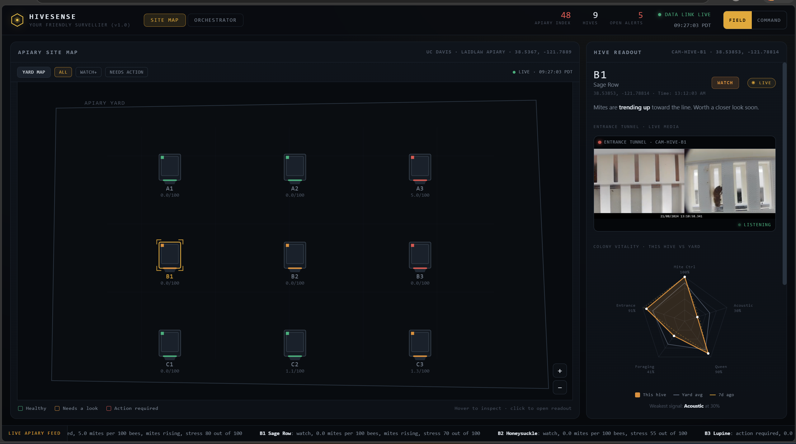
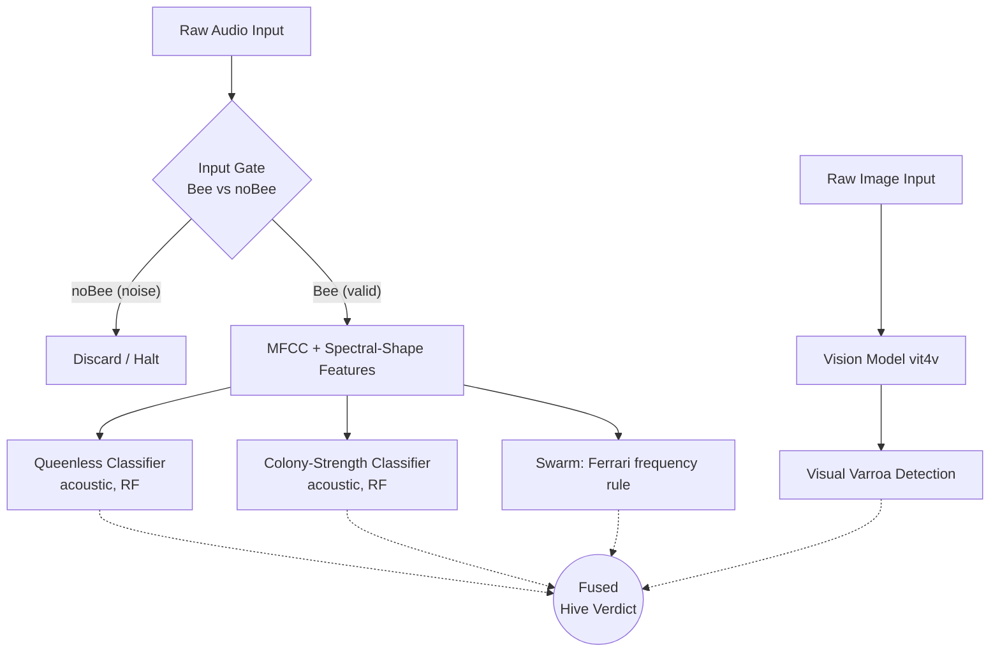
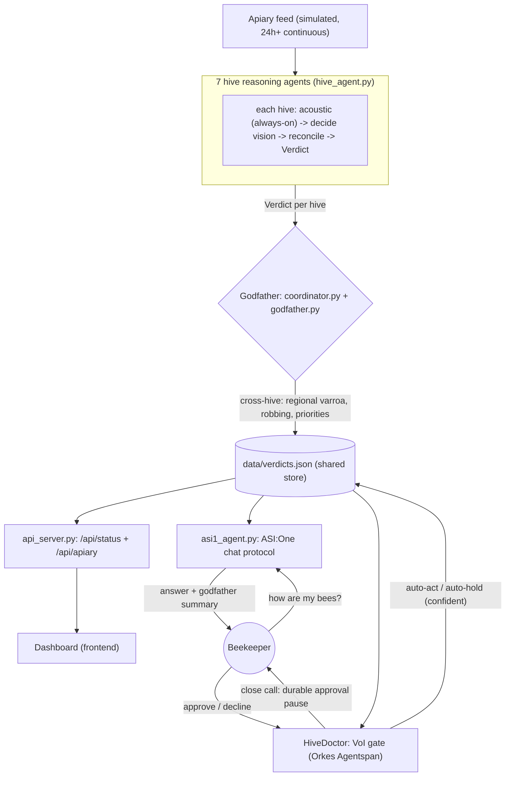
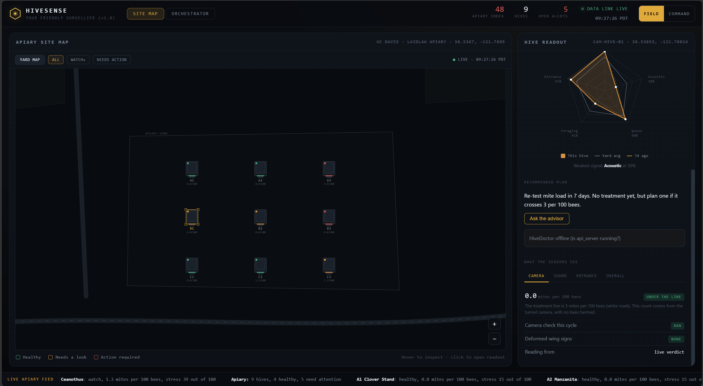
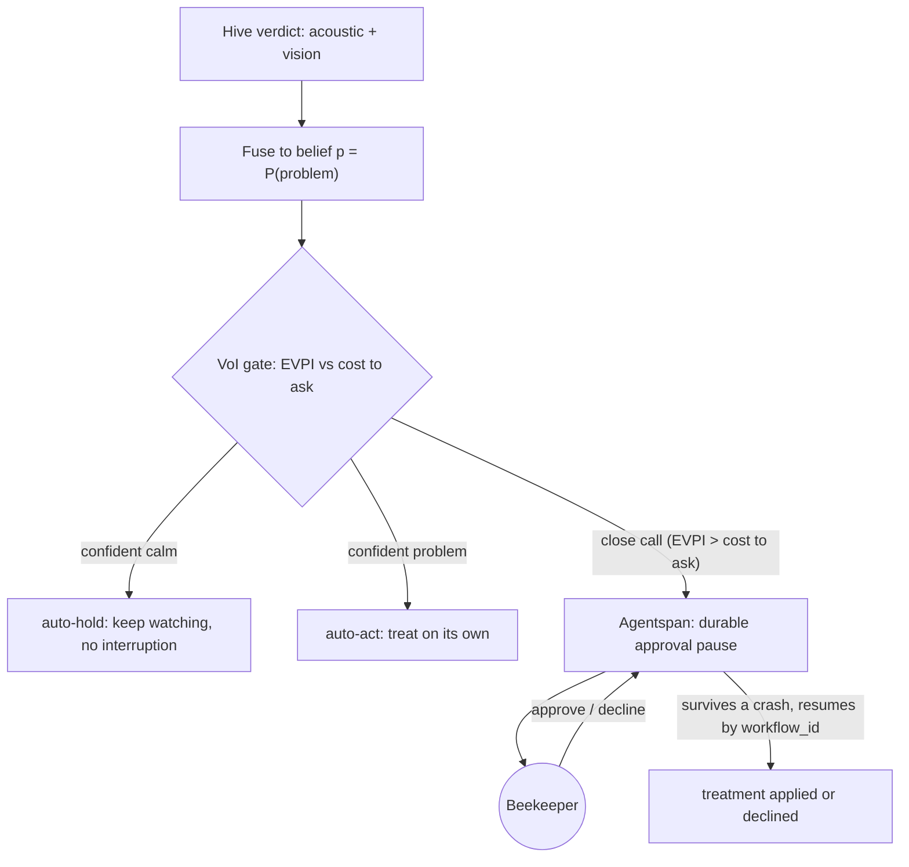
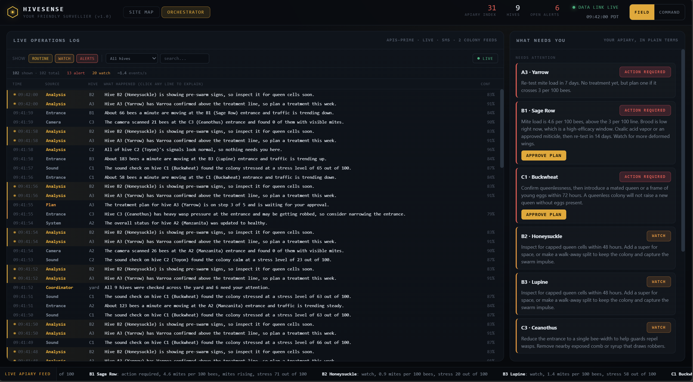

# HiveSense - Non-Invasive Beehive Monitoring

A multimodal (acoustic + vision) pipeline for assessing beehive health *without opening the hive*,
exposed as a live **Fetch.ai uAgent fleet** with an **ASI:One chat interface** and a real-time dashboard.

The guiding principle of this project is **honest evaluation**: every model is validated
**hive-held-out** (no colony appears in both train and test), and we report what the data can and
*cannot* support rather than inflated within-hive numbers.



## What actually works (honest results)

All acoustic models are RandomForests on handcrafted features (13 MFCC + 9 spectral-shape
descriptors, or 20 MSPB audio channels). Metrics are **balanced accuracy**, the only honest split
in brackets.

| Signal | Modality | Dataset | Model | Honest performance | Status |
| :--- | :--- | :--- | :--- | :--- | :--- |
| **Colony strength** (population) | Acoustic | MSPB | RandomForest | **0.646** hive-held-out (baseline 0.658) | shipped (`models/rf_population.pkl`) |
| **Input gate** (bee / noBee) | Acoustic | To-bee | RandomForest | 0.58 hive-held-out / 0.69 within-hive | weak cross-hive (only 6 colonies) |
| **Queenless** | Acoustic | To-bee | RandomForest | 0.18 hive-held-out / 0.88 within-hive | confounded with colony identity |
| **Varroa mites** | Vision | VD2 | ViViT-B (Vit4V, pretrained) | 0.986 acc / 0.988 F1 (paper); locally verified | usable (`models/Vit4V_model.pth`) |
| **Swarm** | Acoustic | - | Ferrari frequency rule | deterministic | rule, no training |

**Key findings (see the notebooks for the evidence):**
- **Population is the one solid acoustic model** - it matches the published MSPB SVM baseline.
- **Queenless looks great within-hive (0.88) but collapses cross-hive (0.18)** - a textbook case of
  the model learning *which colony* rather than *queen state*, because each To-bee colony is recorded
  in only one state. Demonstrating it properly needs many colonies recorded before/after dequeening.

## Validation methodology (why hive-held-out, not a single train/test split)

Every acoustic model is evaluated with **hive-held-out cross-validation**
(`GroupShuffleSplit` / `GroupKFold` grouped on hive id): no colony ever appears in both
the training and test folds, so the score measures generalisation to **colonies the model
has never heard**, which is the only thing a deployed fleet actually faces.

We deliberately do **not** use one fixed train/test split, for two reasons:
1. **Sample size.** With 53 hives (MSPB) or just 6 (To-bee), a single split is luck-driven;
   repeated grouped CV gives a mean and a standard deviation, which is a far more honest
   estimate than one number from one arbitrary partition.
2. **Leakage detection.** Reporting *both* within-hive and hive-held-out scores exposes
   identity leakage. The queenless model is the clearest example: it scores ~0.88 within-hive
   but ~0.18 hive-held-out, which proves it was memorising *which colony* rather than learning
   *queen state* (each To-bee colony is recorded in only one state). A single random split
   would have hidden this and produced a misleadingly good number.

The shipped `.pkl` models are then refit on **all** labelled data (standard practice: validate
with CV, deploy the model trained on everything); the stored metric is always the hive-held-out
score, never the optimistic within-hive one.

## System architecture

A strict **gate** runs before any acoustic health check, and acoustic capabilities are kept separate
from vision capabilities (they detect different things at different scales).



## Agentic layer (Fetch.ai uAgents)

The models are wrapped into a **multi-agent system**: a Host-Worker pattern per hive, scaling up to a
fleet-level coordinator that speaks the official ASI:One chat protocol.



Sensing (uAgents) writes verdicts; the **action** layer (Agentspan) reads them and decides whether to
act alone or pause for the beekeeper. The VoI decision flow is below in the Agentspan section.



### Agent roles
1. **Hive reasoning agents (7, one per hive)** - [`hive_agent.py`](src/agents/hive_agent.py) +
   [`reasoning.py`](src/agents/reasoning.py) + [`tools.py`](src/agents/tools.py). Each runs the cheap
   acoustic detector every cycle, then *decides* (ASI:One asi1, with a deterministic fallback) whether
   the reading is ambiguous enough to spend the expensive tunnel-vision test. It reconciles the two:
   acoustic and vision agree -> confident verdict; they clash -> it does not guess, it sets
   `needs_human` and asks a beekeeper. Models are called as tools; it emits a `Verdict`.
2. **The Godfather (fleet coordinator)** - [`coordinator.py`](src/agents/coordinator.py) +
   [`godfather.py`](godfather.py). Looks across all 7 hives for what no single hive can see: regional
   Varroa pressure, neighbour robbing (influx at one hive vs outflux next door, by position), and a
   prioritised beekeeper action list. It writes the shared verdict store and serves `GET /api/status`.
3. **ASI:One chat agent** - [`asi1_agent.py`](asi1_agent.py). Publishes the official chat protocol
   (`uagents_core.contrib.protocols.chat`) so the apiary is queryable from ASI:One ("how are my bees?"),
   answering from the live verdicts plus the Godfather's summary. Its LLM brain is switchable
   (ASI:One / Gemini / Claude) and degrades to a deterministic, data-only answer if no key is set.

### Why each hive agent has its own memory (isolation by design)

The 7 hive agents are deliberately **mutually blind**. Each one talks only to the Godfather,
keeps only its own private memory (`ctx.storage`, plus its own hive-scoped slice of the optional
Redis store), and never sees another hive's data. All cross-hive intelligence lives in the **one**
place that is meant to have it: the Godfather. This is a **fan-in** topology (7 -> 1), *not* a shared
blackboard that every agent reads and writes.

```
A1 .. C1  --(its own Verdict only)-->  GODFATHER  -->  shared store / dashboard / chat
   (no hive holds another hive's address; no hive reads the global store)
```

We chose isolated per-agent memory over one shared memory for five reasons:

1. **Independent evidence.** The Godfather's headline patterns ("two hives in alert = a regional
   outbreak", "robbing between neighbours") are only trustworthy if each hive's verdict is an
   *independent* observation. If the hives shared memory, hive B could see hive A's alert and drift
   toward agreeing - an echo chamber that **manufactures** correlation instead of measuring it.
2. **Fault and fraud isolation.** A glitching sensor, a corrupted reading, or a compromised node can
   damage only *its own* state. With one shared store, a single bad write is instantly visible to -
   and can mislead - every other agent.
3. **Least privilege (security).** This is a surveillance system, so it follows the security default:
   each agent gets only the data it needs (its own). A shared memory is one fat attack surface;
   isolated memory means breaching one hive does not hand over the whole apiary.
4. **It mirrors the real deployment.** In the field each hive is a separate edge device with its own
   mic, camera and compute - they genuinely do not share RAM. The architecture maps 1:1 onto that, so
   moving from one laptop to N field devices changes nothing. A shared in-memory object would not
   survive that move.
5. **Provenance and audit.** Every verdict has exactly one author. With shared mutable memory you lose
   "who observed what", which is precisely the accountability a monitoring system needs.

The trade-off is intentional: individual hives stay simple and blind, and *all* the "see the whole
yard" reasoning is concentrated in the Godfather (`coordinator.py` `correlate()` + `godfather.py`).
That is the classic defense-in-depth shape - **isolated edges, central oversight.** The boundary is
marked in code (`hive_agent.py`, `run_fleet.py`) so it does not regress.

## Durable action layer (Orkes Agentspan): HiveDoctor, the agent that knows when *not* to ask

Fetch.ai uAgents handle decentralised **sensing**. Orkes **Agentspan** handles the durable, audited
**action** that follows. The hard, under-appreciated skill in any monitoring system is not answering
everything; it is knowing when to stay quiet. The scarce resource was never the agent's compute. It
is the **beekeeper's attention**. Monitoring systems (ICU alarms, security panels, beekeeping apps)
rarely fail by missing things. They fail by crying wolf until people mute them. HiveDoctor is built
to be the cure for that alarm fatigue.

**The Value-of-Information gate** ([`src/agentspan/voi.py`](src/agentspan/voi.py)). For each hive and
condition the agent fuses its sensors into a belief `p = P(real problem)`, then runs a small,
closed-form decision-theory calculation that weighs the **expected value of the beekeeper's input
(EVPI)** against the **cost of interrupting them**. Three outcomes follow:

| Decision | When | What happens |
|---|---|---|
| **auto-hold** | confident all is calm (EVPI below cost to ask) | watches quietly, never bothers you |
| **auto-act** | confident there is a problem (EVPI below cost to ask) | treats on its own, no interruption |
| **ask you** | a genuine close call (EVPI above cost to ask) | **pauses on Agentspan's durable approval gate** |



EVPI is large only when the call is *both uncertain and high-stakes*, and collapses to near zero when
the agent is confident either way. That is why the gate stays quiet at both ends and speaks up only
in the uncertain middle. It is pure math (never an LLM call), so it always runs and you can show the
numbers live: `python src/agentspan/voi.py` prints the worked examples from the paper.

**Grounding (the unique, research-backed part).** This is based on *"Value of Information: A Framework
for Human-Agent Communication"* (arXiv 2601.06407, **Jan 2026**), which uses Value of Information to
weigh an agent's expected utility gain from asking against the cognitive cost on the user. The
lineage runs from Howard's Value of Information (1966), through Horvitz on the cost of interrupting a
user, to KnowNo (Princeton and Google DeepMind, ask when uncertain), and on to the Jan 2026
framework. **Our contribution is the transplant plus the guarantee:** the first VoI-gated
human-in-the-loop on a non-invasive physical colony-monitoring mesh, coupled to Agentspan so that the
question itself survives a crash. The same decision math oil companies use to decide whether a
seismic survey is worth paying for now decides whether waking the beekeeper is worth it. **HiveSense
is non-invasive twice:** we do not disturb the colony to sense it, and we do not disturb the
beekeeper unless the math says they are needed.

**Why Agentspan.** When the gate decides to ask, the treatment action is an
`@tool(approval_required=True)`. Agentspan pauses the run server-side and holds it **indefinitely and
crash-safe**, resuming by `workflow_id`. The pause is the payoff of the VoI calculation, so the
platform's flagship feature (durable human-in-the-loop) is justified by a real algorithm rather than
decoration. It degrades gracefully: with the server up, runs execute on the durable engine; without
it, the same gate and approval flow run through a durable on-disk registry
([`runs.py`](src/agentspan/runs.py)) so a demo never breaks.



```bash
pip install agentspan
export GEMINI_API_KEY=...                # LLM reasoning uses Gemini (google_gemini/gemini-2.5-flash)
agentspan server start                   # serves http://localhost:6767 (durable engine + console)

python seed_voi_demo.py                  # give hives a spread of severities for a clear demo
python demo_hive_doctor.py               # sweep: see which hives it watches, treats, or asks about
python demo_hive_doctor.py A3            # one hive plus the durable human-in-the-loop gate
AGENTSPAN_LIVE=1 python demo_hive_doctor.py A3   # run on the live Agentspan engine
```

In the dashboard, open any hive. The **HiveDoctor (Orkes Agentspan)** panel shows the decision in
plain language, a "why" toggle with the live VoI maths (`p`, EVPI versus cost-to-ask), and, only on a
close call, an **Approve / Decline** gate wired to `POST /api/treatment/respond`. The durability
demo: kill the worker at the approval pause, restart it, and Agentspan resumes from exactly where it
stopped (load-bearing on the live engine).

## Datasets

UrBAN was **dropped** from the project: it is a phenotyping dataset (queen status, colony size, brood)
with **no Varroa labels**, and its acoustic feature space is unrelated to the Abdollahi varroa work.

| Dataset | Used for | Notes |
| :--- | :--- | :--- |
| **MSPB** (Zenodo 11398835) | Population + (attempted) Varroa | Pre-extracted 20 audio features + phenotype labels. Sensor hive id `tag_number` joins to phenotype `Hive ID` by stripping the leading `20`. |
| **To-bee** (NU-Hive / OSBH) | Gate + Queenless | Raw audio + `.lab` bee/noBee intervals; queen state in filenames (mind the `NO_QueenBee` substring trap). |
| **vit4v / BUT** | Vision Varroa | Pretrained vision model + co-registered image/audio for the demo. |

### Audio provenance (which mic, and why it matters)

The acoustic models are trained on **inside-the-hive colony sound** (MSPB BeeHub devices and
To-bee in-hive recordings) - whole-colony acoustics, the right scale for queenless / population /
stress signals. The **BUT-2 / boortel device is an *entrance-tunnel* device**: its camera films
bees walking through 8 mm tunnels and its mic captures entrance-area sound. These are different
acoustic domains, so BUT-2 audio is **not** used for the in-hive acoustic models (domain mismatch,
and BUT-2 ships no health labels). BUT-2 is used for **vision only**.

## Vision model - Vit4V (Varroa from tunnel video)

`models/Vit4V_model.pth` is a fine-tuned **ViViT-B video transformer**
(`google/vivit-b-16x2-kinetics400`): input = a **32-frame, 224x224 RGB clip** of a bee passing the
tunnel, output = a single sigmoid logit = P(Varroa). Loader: [`src/vit4v_infer.py`](src/vit4v_infer.py).

- **It is usable.** The checkpoint loads cleanly (0 missing / 0 unexpected keys, 88.6M params) and
  runs. It **requires `transformers==4.44.2`** - v5.x renamed the ViViT layers and would silently
  load the encoder with random weights, so the loader raises if the keys don't match exactly.
- **Run the smoke test:** `python src/vit4v_infer.py` (rebuilds the architecture, loads the weights,
  runs a synthetic clip end-to-end).
- **Run a real clip / live demo:** [`src/run_demo.py`](src/run_demo.py) classifies a bee as
  INFESTED vs CLEAR from a VD2 clip:
  `python src/run_demo.py --video dataset/vd2/varroa_infested/<clip>.mkv`
  (`--frames dir/` for the pre-cropped frame dataset; `--annotate out.mp4` to burn the verdict in).
  **Critical:** the model is run on a *bee crop*, not the raw frame - `run_demo` reuses the official
  `VideoSegmenter` (background-subtraction + largest-contour 224px box) from the cloned
  `github/vit4v` repo, then classifies contiguous 32-frame windows. Feeding the whole UHD frame makes
  the bee a few pixels and the model wrongly says CLEAR. Verified: infested clip -> INFESTED (p~0.75),
  healthy clip -> CLEAR (p~0.00).
  Download a few VD2 clips without the 200 GB archive:
  `kaggle datasets download -d <owner/slug> -f "varroa_infested/<file>.mkv" --unzip`
  (read `<owner/slug>` off the opened DOI page; grab ~2 infested + 1 healthy for the demo).
- **Labelled test set = VD2 (the model's own benchmark).** Vit4V was trained/tested on the
  **Varroa Destructor Video dataset (VD2)**: 607 RGB videos / ~37,890 frames, balanced
  `varroa_infested` vs `varroa_free`, segmentable into the 32-frame clips the model expects. This is
  the correct dataset to *quantitatively* test the checkpoint and the reference format for our own
  phone-over-tunnel captures. Kaggle (title "EV2 Video Dataset"):
  video `https://doi.org/10.34740/kaggle/dsv/11159683`, frames `https://doi.org/10.34740/kaggle/dsv/11254629`.
- **BUT-2 is vision-modality-correct but unusable for accuracy:** it has **no per-bee Varroa labels**
  (the BUT group's Varroa ground truth is in the separate hyperspectral BUT-HS/HS2 sets), so it is at
  best a qualitative demo, not a scored test.
- **Image-only fallbacks** (for a per-frame detector instead of the video model): VarroaDataset
  (Zenodo `10.5281/zenodo.4085044`, healthy vs infested bee crops) and Roboflow varroa sets.

## Citations & benchmarks

### Datasets & models

- Zhu, Y., Abdollahi, M., Maucourt, S., Coallier, N., Guimarães, H. R., Giovenazzo, P., & Falk, T. H.
  (2024). *MSPB: a longitudinal multi-sensor dataset with phenotypic trait measurements from honey bees.*
  Scientific Data 11, 860. (Data: Zenodo doi:10.5281/zenodo.8371700; preprint arXiv:2311.10876)
- Nolasco, I., & Benetos, E. (2018). *To bee or not to bee: investigating machine learning approaches for
  beehive sound recognition.* DCASE 2018 Workshop. arXiv:1811.06016
- Giovannesi, L., et al. (2025). *Vit4V: a Video Classification Method for the Detection of Varroa
  Destructor.* CVPR 2025 Workshops. (code: github.com/kernel-machine/vit4v)
- Arnab, A., Dehghani, M., Heigold, G., Sun, C., Lučić, M., & Schmid, C. (2021). *ViViT: A Video Vision
  Transformer.* ICCV 2021. arXiv:2103.15691
- Abdollahi, M., et al. *On the Prediction of Varroa Mite Infestations in Honey Bee Colonies via Acoustic
  Monitoring.* IEEE Sensors Journal (2026). (ROC-AUC 0.874)
- Ferrari, S., Silva, M., Guarino, M., & Berckmans, D. (2008). *Monitoring of swarming sounds in bee hives
  for early detection of the swarming period.* Computers and Electronics in Agriculture, 64(1), 72-77.
- Abdollahi, M., Zhu, Y., Guimarães, H. R., Coallier, N., Maucourt, S., Giovenazzo, P., & Falk, T. H.
  (2025). *UrBAN: Urban Beehive Acoustics and PheNotyping Dataset.* Scientific Data 12, 536.
  doi:10.1038/s41597-025-04869-1 (arXiv:2406.03657)

### Agent & decision-theory references

- *Value of Information: A Framework for Human-Agent Communication.* arXiv:2601.06407
- Howard, R. A. (1966). *Information Value Theory.* IEEE Transactions on Systems Science and Cybernetics,
  2(1), 22-26.
- Horvitz, E. (1999). *Principles of Mixed-Initiative User Interfaces.* CHI 1999.
- Ren, A. Z., et al. (2023). *Robots That Ask For Help: Uncertainty Alignment for Large Language Model
  Planners (KnowNo).* CoRL 2023. arXiv:2307.01928

### Benchmark summary

| Task | Dataset | Model | Published baseline | Ours (hive-held-out unless noted) |
| :--- | :--- | :--- | :--- | :--- |
| Colony strength | MSPB | RandomForest | SVM 0.658 balanced acc (MSPB paper) | **0.646 +/- 0.065** |
| Input gate (bee/noBee) | To-bee | RandomForest | - | 0.578 cross-hive / 0.689 within-hive |
| Queenless | To-bee | RandomForest | - | 0.184 cross-hive / 0.883 within-hive (confounded) |
| Varroa (acoustic) | MSPB | - | Abdollahi 0.874 AUC (different data) | untrainable (0 hives reach 3%) |
| Varroa (vision) | VD2 | ViViT-B (Vit4V) | **0.986 acc / 0.988 F1** (Vit4V paper) | verified on VD2: infested p~0.75, healthy p~0.00 |

All metrics are **balanced accuracy** unless stated. "Cross-hive" = GroupShuffleSplit on hive id;
"within-hive" = random StratifiedKFold (shown only to expose leakage). The vision row is the paper's
held-out number plus our local sanity check on downloaded VD2 clips (not a full re-run of the benchmark).

## Configuration (.env)

All configuration is via environment variables, read from a `.env` file at the repo root
(loaded automatically by `api_server.py`). Copy [`.env.example`](.env.example) to `.env` and
fill in what you need. **Everything is optional:** with no keys set, the system runs in
deterministic fallback mode (no LLM, no Redis, no Agentverse), so the demo always works. The
real `.env` is gitignored, so never commit your keys.

```bash
cp .env.example .env     # then edit .env
```

| Variable | Used by | Default / notes |
| :--- | :--- | :--- |
| `GEMINI_API_KEY` | HiveDoctor explanations, `explain`/`advise`, chat | the project's default LLM (Google AI Studio key) |
| `GEMINI_MODEL` | Gemini calls | `gemini-2.5-flash` |
| `GOOGLE_CLOUD_PROJECT` | Agentspan server's Gemini provider | only needed for the live engine |
| `ASI_ONE_API_KEY` | uAgent reasoning + ASI:One chat | falls back to deterministic policy if unset |
| `ANTHROPIC_API_KEY` / `ANTHROPIC_MODEL` | optional Claude fallback | `claude-3-5-sonnet-latest` |
| `LLM_PROVIDER` | explicit provider selector | optional (`asi1` / `gemini` / `anthropic`) |
| `AGENTSPAN_LIVE` | HiveDoctor durable engine | `0`; set `1` to run on the live Agentspan server |
| `AGENTSPAN_MODEL` | Agentspan agent model string | `google_gemini/gemini-2.5-flash` |
| `USE_REDIS` | multimodal memory backend | `0`; set `1` for Redis Stack, else file store |
| `REDIS_URL` / `REDIS_TIMEOUT` | Redis connection | `redis://localhost:6379`, falls back on timeout |
| `AGENTVERSE_API_KEY` | Fetch.ai mailbox / Agentverse registration | needed for the hosted fleet |
| `MAILBOX` | uAgent connectivity | `1` mailbox, `0` local-only |
| `AGENT_SEED` / `AGENT_ENDPOINT` / `AGENT_CONNECT_URL` / `AGENT_TYPE` | uAgent identity + connectivity | self-hosted / advanced |
| `PORT` | `api_server.py` | `8000` |
| `FEED_INTERVAL` / `HIVE_PERIOD` | simulated feed + hive cycle timing | seconds |
| `ROBOFLOW_API_KEY` / `KAGGLE_API_TOKEN` | dataset downloads only | not needed to run the demo |

For the durable Agentspan engine specifically: set `GEMINI_API_KEY` (and `GOOGLE_CLOUD_PROJECT`),
then `AGENTSPAN_LIVE=1`, and run `agentspan server start` (needs Java 21). Without it, the VoI gate
and approval flow still run through the on-disk registry.

## Reproducing the results

```bash
pip install -r requirements.txt

# Train + save the three trainable models (writes to models/*.pkl):
python src/train_population.py        # MSPB colony strength
python src/train_gate_queenless.py    # To-bee gate + queenless (caches features first)
python src/train_varroa_acoustic.py   # MSPB varroa -> flags single-class, saves nothing

# --- Live demo (no uAgents / no mailbox needed - the reliable path) ---
python seed_apiary.py                 # lay down 24h of data for all 7 hives (run once)
python api_server.py                  # serve /api/status + /api/apiary on :8000
python live_feed.py                   # (optional, own terminal) keep extending the timeline live
python asi1_agent.py                  # ASI:One chat agent (answers from the live data)

# --- Full uAgent fleet (optional - needs the system clock in sync for the mailbox) ---
python -m src.agents.run_coordinator  # the Godfather; prints an Agentverse Inspector link
python -m src.agents.run_fleet        # the 7 hive reasoning agents

# Dashboard (Vite proxies /api -> :8000; run ONE thing on :8000):
cd frontend && npm install && npm run dev
```

## Redis Stack - the apiary's multimodal memory (optional, `USE_REDIS=1`)

By default the fleet shares state through a single JSON file (`data/verdicts.json`). That file
is **rewritten in full on every append** and read back in full on every request - fine for a
demo, but it cannot do similarity search and the write cost grows with history. Setting
`USE_REDIS=1` swaps in a Redis Stack backend that uses four of its modules, each for a concrete
need. **Nothing else changes**: every component goes through `hive_state.py`, which delegates to
the selected backend (`src/store/`). If `USE_REDIS=1` but Redis is unreachable (or is a plain
Redis without the Stack modules), it logs a warning and **falls back to the file store** - the
demo never breaks.

| Capability | Module | Keys | What it gives us |
| :--- | :--- | :--- | :--- |
| Live verdict state | RedisJSON | `hs:hive:{id}` (latest), `hs:hive:{id}:hist` (history) | `JSON.ARRAPPEND` + `ARRTRIM` append **one** doc instead of rewriting the whole file |
| Per-hive metrics | RedisTimeSeries | `hs:ts:{id}:{acoustic_stress\|traffic\|mite_rate}` | `RETENTION 24h` enforces the rolling window; `TS.MRANGE` reads every hive in one call |
| Similarity search | RediSearch (HNSW) | `hs:reading:{id}:{ts}` + index `hs:idx` | filtered vector k-NN ("find past states like this hive's now") - the file store cannot |
| Live push | Pub/Sub | channel `hs:events` | dashboard refreshes the instant a verdict lands (SSE), not on the 2s poll |

**One bound vector per reading (the "unimodal" idea, done right).** Each reading is stored as a
**single fused 86-d vector** = `L2(acoustic_22) ⊕ L2(vision_64)`, L2-normalised - a lightweight
*early fusion*. The acoustic half is the existing MFCC/spectral set; the vision half is the ViViT
encoder's CLS token through a fixed seeded random projection (real ViViT, no new trained weights;
a handcrafted fallback labelled `vision_source` when no clip is on hand). One vector → **one HNSW
index → one k-NN query** powers **retrieval-augmented reasoning**: before the brain reconciles
acoustic-vs-vision, it recalls the hive's most similar past states
(`reasoning.reconcile(..., similar=...)`), e.g. a look-alike reading a beekeeper later confirmed
was a false alarm.

This is the early-fusion / single-tower direction the literature validates
([ImageBind](https://arxiv.org/abs/2305.05665), [FuseLIP](https://arxiv.org/abs/2506.03096),
MM-Embed). The **real bound space** is the optional [`src/imagebind_embed.py`](src/imagebind_embed.py)
adapter: with `pip install git+https://github.com/facebookresearch/ImageBind.git` it maps a bee
image and audio clip into one aligned space, unlocking cross-modal retrieval (query by sound,
retrieve by sight) and embedding arithmetic. Honest caveat: ImageBind's audio encoder is general,
not bee-specific, so the bee-domain alignment is approximate - but it is a *true* shared space,
which a concat is not. *(There is no steganographic packing - an earlier draft tried hiding audio
bytes in a PNG; on live Redis it inflated memory and only saved round-trips, so it was dropped in
favour of the single vector.)*

**Measured on live Redis Cloud** (`bench/redis_bench.py`, 3000 readings): one fused vector =
**1 index, 1 query, ~28 ms, 2.05 MB**; late fusion (separate acoustic + vision vectors) =
**2 indexes, 2 queries, ~40 ms, 3.09 MB** → ~1.4× fewer query round-trips and ~34% less index
memory, *and* it is the only layout with a shared space to search across.

**Run it** (any Redis Stack - local Docker, or a managed Redis Cloud URL; no API key, just
`REDIS_URL` in `.env`):
```bash
# option A: local Docker         docker run -d -p 6379:6379 -p 8001:8001 redis/redis-stack:latest
# option B: Redis Cloud (no install)  -> set REDIS_URL=redis://default:<pw>@<host>:<port> in .env
USE_REDIS=1 python scripts/redis_smoke.py        # verify the live path (PASS/FAIL per capability)
USE_REDIS=1 python -m src.agents.run_fleet       # fleet writes JSON + TS + one fused vector/reading
USE_REDIS=1 python api_server.py                 # serves /api/similar + /api/events (SSE)
python bench/redis_bench.py --n 300              # one-index vs late-fusion + vector + state numbers
# notebooks/redis_unimodal_showcase.ipynb        # the full, honest, runnable showcase
```

**Why one fused vector (the five points the showcase notebook proves with plots):**
1. one fused vector still separates the hive states (cosine heatmap),
2. one vector → one HNSW index → one k-NN query; late fusion needs two indexes, two queries, a merge,
3. filtered similarity (`@hive` + k-NN) is a single Redis query a numpy scan/late-fusion can't match,
4. for live state the file-rewrite cost grows with history while one append stays flat,
5. the real upgrade is a *bound* space (ImageBind) for cross-modal search + embedding arithmetic.

**Honest claims vs marketing.** Defensible: one fused vector → one index → one query (fewer
round-trips + less memory than late fusion, measured); built-in 24h retention; filtered vector
k-NN enabling RAG. Do **not** overclaim: the live fusion is a concat (lightweight early fusion),
not a trained joint encoder - true cross-modal retrieval/arithmetic need the bound ImageBind space;
the ViViT half is an honest CLS projection (labelled `vision_source`); a **remote** Redis is
network-bound, so it does *not* beat a local file on single-op latency (its value is capabilities +
concurrency); and the apiary feed is still simulated.

## Dashboard API

`api_server.py` exposes two read-only JSON endpoints on `:8000`; the Vite dev server already
proxies `/api` to it. Run ONE thing on 8000 (this server, not the old mock).

- `GET /api/status` -> `{ "hives": { "<HIVE>": [verdict, ...] } }`, up to 24h+ of history per
  hive. Each verdict carries: `varroa_status` (clear|watch|alert), `queenless_alert`,
  `swarm_alert`, `traffic` (signed net flow), `position` `[x, y]`, `needs_human`, `reason`,
  `timestamp`, plus the per-detector signals `acoustic_stress` (0..1), `vision_mite_rate`,
  `vision_ran`.
- `GET /api/apiary` -> the Godfather's apiary-wide read, for a top-level panel:
  `{ headline, healthy, alerts[], watches[], needs_human[], queenless[], swarming[],
  emergent[], priorities[ {hive, action, why} ] }`.
- `GET /api/similar?hive=<HIVE>&k=5` -> Redis vector k-NN: readings most similar to that hive's
  current state, `{ hive, similar: [{key, hive, ts, varroa_status, needs_human, score}] }`.
  Returns an empty list with a `note` when running on the file store (no `USE_REDIS`).
- `GET /api/events` -> Server-Sent Events stream bridged from the Redis `hs:events` channel
  (instant push). Returns `501` on the file store; the frontend keeps its 2s poll regardless.

Suggested additions: a **Godfather panel** bound to `/api/apiary` (headline + prioritised
actions + emergent patterns like regional Varroa / robbing), and per-hive cards that show the
**acoustic-vs-vision reasoning** (`acoustic_stress` vs `vision_mite_rate`) with an "inspect"
badge when `needs_human` is true.

## Directory structure

- `dataset/` (git-ignored) - `MSPB/`, `to_bee_or_no_to_bee/`, `vd2/` audio/video + labels.
- `eda/` - analysis notebooks (`mspb_eda.ipynb`, `tobee_gate_queen_eda.ipynb`), each structured as
  Question, Plot, Reasoning. `eda/cache/` (git-ignored) holds extracted To-bee features.
- `src/`
  - `mspb_loader.py`, `tobee_loader.py` - dataset loaders (features + labels + hive id).
  - `train_population.py`, `train_varroa_acoustic.py`, `train_gate_queenless.py` - acoustic training.
  - `vit4v_infer.py` - load the Vit4V checkpoint (+ `embed_clip` for the vision embedding);
    `run_demo.py` - classify a clip / annotate a video.
  - `embedding.py` - fuse acoustic + vision into the 86-d single vector for Redis k-NN.
  - `imagebind_embed.py` - optional, import-guarded ImageBind adapter (the real bound space).
  - `store/` - pluggable backend: `base.py` (contract), `file_store.py` (JSON file, default),
    `redis_store.py` (Redis Stack), `__init__.py` (`get_store()` factory + `USE_REDIS` fallback).
  - `agents/` - uAgent fleet: `hive_agent.py` + `reasoning.py` + `tools.py` (the 7 hive brains),
    `run_fleet.py` (launch them), `coordinator.py` + `run_coordinator.py` (the Godfather),
    `connect_mailbox.py` (mailbox helper), `schema.py`.
- `scripts/redis_smoke.py` - Redis path PASS/FAIL check; `bench/redis_bench.py` - Redis-vs-file
  + one-index-vs-late-fusion benchmark; `notebooks/redis_unimodal_showcase.ipynb` - full showcase.
- Root agent/data layer: `asi1_agent.py` (ASI:One chat), `asi1_agent_hosted.py` (hosted backup),
  `asi1_client.py` (local test), `hive_state.py` (shared store), `godfather.py` (apiary analysis),
  `seed_apiary.py` (24h data), `live_feed.py` (live continuation), `api_server.py` (dashboard API).
- `data/` (git-ignored) - `verdicts.json`: the shared 24h+ store read by the agent, API, and dashboard.
- `models/` (git-ignored) - `rf_population.pkl`, `rf_gate.pkl`, `rf_queenless.pkl`, `Vit4V_model.pth`.
- `github/vit4v/` - cloned upstream repo; `run_demo.py` imports its `VideoSegmenter`.
- `frontend/` - Vite dashboard that renders live hive verdicts (`src/`, `index.html`, `vite.config.js`).
