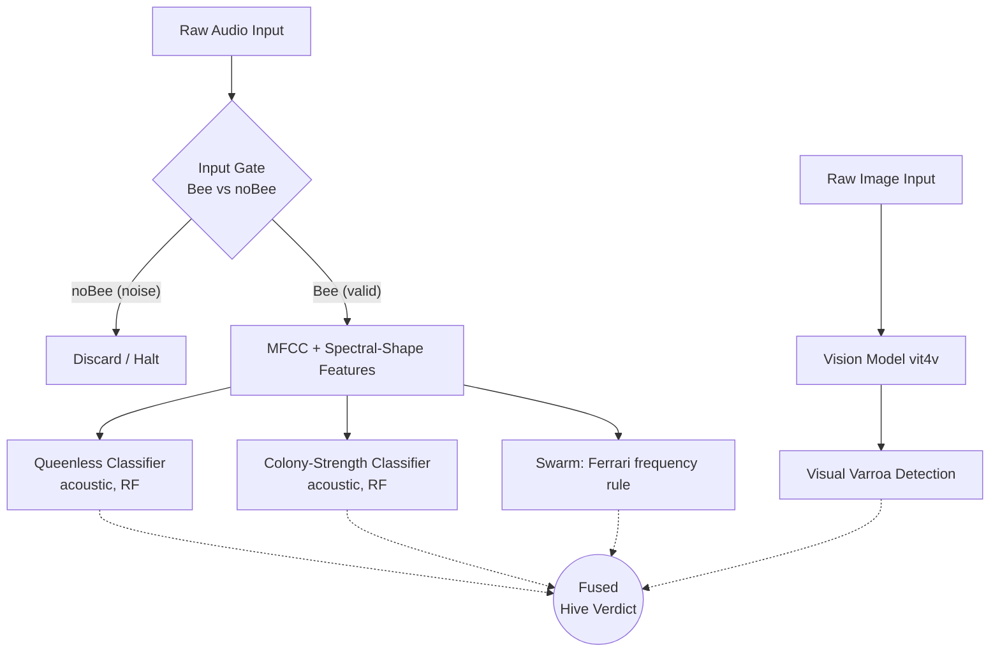
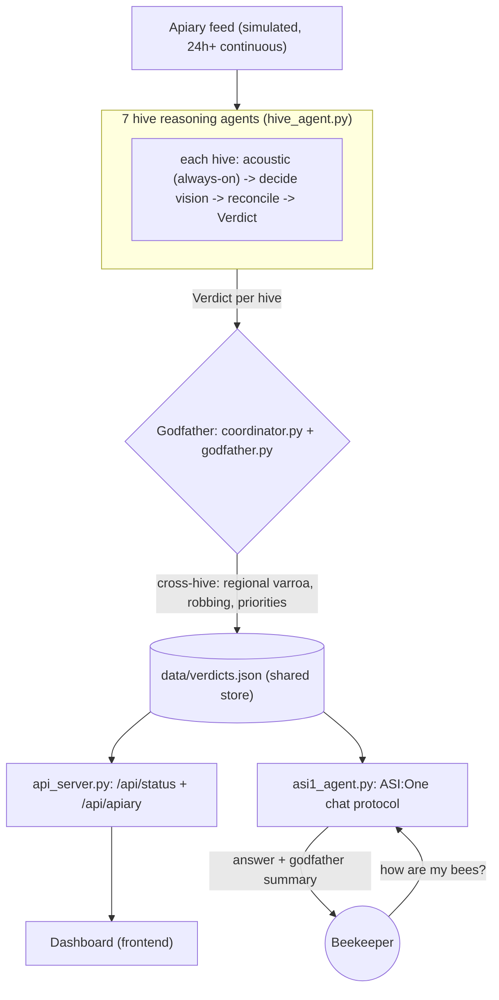

# HiveSense - Non-Invasive Beehive Monitoring

A multimodal (acoustic + vision) pipeline for assessing beehive health *without opening the hive*,
exposed as a live **Fetch.ai uAgent fleet** with an **ASI:One chat interface** and a real-time dashboard.

The guiding principle of this project is **honest evaluation**: every model is validated
**hive-held-out** (no colony appears in both train and test), and we report what the data can and
*cannot* support rather than inflated within-hive numbers.

## What actually works (honest results)

All acoustic models are RandomForests on handcrafted features (13 MFCC + 9 spectral-shape
descriptors, or 20 MSPB audio channels). Metrics are **balanced accuracy**, the only honest split
in brackets.

| Signal | Modality | Dataset | Model | Honest performance | Status |
| :--- | :--- | :--- | :--- | :--- | :--- |
| **Colony strength** (population) | Acoustic | MSPB | RandomForest | **0.646** hive-held-out (baseline 0.658) | shipped (`models/rf_population.pkl`) |
| **Input gate** (bee / noBee) | Acoustic | To-bee | RandomForest | 0.58 hive-held-out / 0.69 within-hive | weak cross-hive (only 6 colonies) |
| **Queenless** | Acoustic | To-bee | RandomForest | 0.18 hive-held-out / 0.88 within-hive | confounded with colony identity |
| **Varroa mites** | Acoustic | MSPB | - | 0 hives reach the 3% threshold | not learnable from this data |
| **Varroa mites** | Vision | VD2 | ViViT-B (Vit4V, pretrained) | 0.986 acc / 0.988 F1 (paper); locally verified | usable (`models/Vit4V_model.pth`) |
| **Swarm** | Acoustic | - | Ferrari frequency rule | deterministic | rule, no training |

**Key findings (see the notebooks for the evidence):**
- **Population is the one solid acoustic model** - it matches the published MSPB SVM baseline.
- **Varroa cannot be detected acoustically here**: across ~100 MSPB inspections, *none* reach the
  3% economic treatment threshold, so the label is single-class. Mites stay a **vision** task; the
  trainer refuses to fabricate a label.
- **Queenless looks great within-hive (0.88) but collapses cross-hive (0.18)** - a textbook case of
  the model learning *which colony* rather than *queen state*, because each To-bee colony is recorded
  in only one state. Demonstrating it properly needs many colonies recorded before/after dequeening.

## Validation methodology (why hive-held-out, not a single train/test split)

Every acoustic model is evaluated with **hive-held-out cross-validation**
(`GroupShuffleSplit` / `GroupKFold` grouped on hive id): no colony ever appears in both
the training and test folds, so the score measures generalisation to **colonies the model
has never heard**, which is the only thing a deployed fleet actually faces.

We deliberately do **not** use one fixed train/test split, for two reasons:
1. **Sample size.** With 53 hives (MSPB) or just 6 (To-bee), a single split is luck-driven;
   repeated grouped CV gives a mean and a standard deviation, which is a far more honest
   estimate than one number from one arbitrary partition.
2. **Leakage detection.** Reporting *both* within-hive and hive-held-out scores exposes
   identity leakage. The queenless model is the clearest example: it scores ~0.88 within-hive
   but ~0.18 hive-held-out, which proves it was memorising *which colony* rather than learning
   *queen state* (each To-bee colony is recorded in only one state). A single random split
   would have hidden this and produced a misleadingly good number.

The shipped `.pkl` models are then refit on **all** labelled data (standard practice: validate
with CV, deploy the model trained on everything); the stored metric is always the hive-held-out
score, never the optimistic within-hive one.

## System architecture

A strict **gate** runs before any acoustic health check, and acoustic capabilities are kept separate
from vision capabilities (they detect different things at different scales).



## Agentic layer (Fetch.ai uAgents)

The models are wrapped into a **multi-agent system**: a Host-Worker pattern per hive, scaling up to a
fleet-level coordinator that speaks the official ASI:One chat protocol.



### Agent roles
1. **Hive reasoning agents (7, one per hive)** - [`hive_agent.py`](src/agents/hive_agent.py) +
   [`reasoning.py`](src/agents/reasoning.py) + [`tools.py`](src/agents/tools.py). Each runs the cheap
   acoustic detector every cycle, then *decides* (ASI:One asi1, with a deterministic fallback) whether
   the reading is ambiguous enough to spend the expensive tunnel-vision test. It reconciles the two:
   acoustic and vision agree -> confident verdict; they clash -> it does not guess, it sets
   `needs_human` and asks a beekeeper. Models are called as tools; it emits a `Verdict`.
2. **The Godfather (fleet coordinator)** - [`coordinator.py`](src/agents/coordinator.py) +
   [`godfather.py`](godfather.py). Looks across all 7 hives for what no single hive can see: regional
   Varroa pressure, neighbour robbing (influx at one hive vs outflux next door, by position), and a
   prioritised beekeeper action list. It writes the shared verdict store and serves `GET /api/status`.
3. **ASI:One chat agent** - [`asi1_agent.py`](asi1_agent.py). Publishes the official chat protocol
   (`uagents_core.contrib.protocols.chat`) so the apiary is queryable from ASI:One ("how are my bees?"),
   answering from the live verdicts plus the Godfather's summary. Its LLM brain is switchable
   (ASI:One / Gemini / Claude) and degrades to a deterministic, data-only answer if no key is set.

## Datasets

UrBAN was **dropped** from the project: it is a phenotyping dataset (queen status, colony size, brood)
with **no Varroa labels**, and its acoustic feature space is unrelated to the Abdollahi varroa work.

| Dataset | Used for | Notes |
| :--- | :--- | :--- |
| **MSPB** (Zenodo 11398835) | Population + (attempted) Varroa | Pre-extracted 20 audio features + phenotype labels. Sensor hive id `tag_number` joins to phenotype `Hive ID` by stripping the leading `20`. |
| **To-bee** (NU-Hive / OSBH) | Gate + Queenless | Raw audio + `.lab` bee/noBee intervals; queen state in filenames (mind the `NO_QueenBee` substring trap). |
| **vit4v / BUT** | Vision Varroa | Pretrained vision model + co-registered image/audio for the demo. |

### Audio provenance (which mic, and why it matters)

The acoustic models are trained on **inside-the-hive colony sound** (MSPB BeeHub devices and
To-bee in-hive recordings) - whole-colony acoustics, the right scale for queenless / population /
stress signals. The **BUT-2 / boortel device is an *entrance-tunnel* device**: its camera films
bees walking through 8 mm tunnels and its mic captures entrance-area sound. These are different
acoustic domains, so BUT-2 audio is **not** used for the in-hive acoustic models (domain mismatch,
and BUT-2 ships no health labels). BUT-2 is used for **vision only**.

## Vision model - Vit4V (Varroa from tunnel video)

`models/Vit4V_model.pth` is a fine-tuned **ViViT-B video transformer**
(`google/vivit-b-16x2-kinetics400`): input = a **32-frame, 224x224 RGB clip** of a bee passing the
tunnel, output = a single sigmoid logit = P(Varroa). Loader: [`src/vit4v_infer.py`](src/vit4v_infer.py).

- **It is usable.** The checkpoint loads cleanly (0 missing / 0 unexpected keys, 88.6M params) and
  runs. It **requires `transformers==4.44.2`** - v5.x renamed the ViViT layers and would silently
  load the encoder with random weights, so the loader raises if the keys don't match exactly.
- **Run the smoke test:** `python src/vit4v_infer.py` (rebuilds the architecture, loads the weights,
  runs a synthetic clip end-to-end).
- **Run a real clip / live demo:** [`src/run_demo.py`](src/run_demo.py) classifies a bee as
  INFESTED vs CLEAR from a VD2 clip:
  `python src/run_demo.py --video dataset/vd2/varroa_infested/<clip>.mkv`
  (`--frames dir/` for the pre-cropped frame dataset; `--annotate out.mp4` to burn the verdict in).
  **Critical:** the model is run on a *bee crop*, not the raw frame - `run_demo` reuses the official
  `VideoSegmenter` (background-subtraction + largest-contour 224px box) from the cloned
  `github/vit4v` repo, then classifies contiguous 32-frame windows. Feeding the whole UHD frame makes
  the bee a few pixels and the model wrongly says CLEAR. Verified: infested clip -> INFESTED (p~0.75),
  healthy clip -> CLEAR (p~0.00).
  Download a few VD2 clips without the 200 GB archive:
  `kaggle datasets download -d <owner/slug> -f "varroa_infested/<file>.mkv" --unzip`
  (read `<owner/slug>` off the opened DOI page; grab ~2 infested + 1 healthy for the demo).
- **Labelled test set = VD2 (the model's own benchmark).** Vit4V was trained/tested on the
  **Varroa Destructor Video dataset (VD2)**: 607 RGB videos / ~37,890 frames, balanced
  `varroa_infested` vs `varroa_free`, segmentable into the 32-frame clips the model expects. This is
  the correct dataset to *quantitatively* test the checkpoint and the reference format for our own
  phone-over-tunnel captures. Kaggle (title "EV2 Video Dataset"):
  video `https://doi.org/10.34740/kaggle/dsv/11159683`, frames `https://doi.org/10.34740/kaggle/dsv/11254629`.
- **BUT-2 is vision-modality-correct but unusable for accuracy:** it has **no per-bee Varroa labels**
  (the BUT group's Varroa ground truth is in the separate hyperspectral BUT-HS/HS2 sets), so it is at
  best a qualitative demo, not a scored test.
- **Image-only fallbacks** (for a per-frame detector instead of the video model): VarroaDataset
  (Zenodo `10.5281/zenodo.4085044`, healthy vs infested bee crops) and Roboflow varroa sets.

### Mite localization: why a classifier, not a detector

Vit4V is a clip **classifier** (32 frames in, one P(Varroa) out); it **cannot draw a box on the mite**.
True localization needs a separate **object detector** (YOLO-style) trained on **bounding-box-annotated**
mite data (e.g. VarroaDataset, Zenodo 4085044) - a new model trained from scratch, *not* a fine-tune
of Vit4V. We deliberately keep the classifier because:

- the operational question is "**is this bee infested?**", which the classifier answers and the fleet
  acts on;
- localization only earns its cost if you need per-bee mite **counts / infestation rate** (mites per
  100 bees) - a separate, post-hackathon effort;
- for an explainability visual ("where did the model look?"), use **ViViT attention-rollout / Grad-CAM**
  on the bee crop - a heatmap that needs **no new data or training**.

The only *fine-tune* that would help is **domain adaptation** of the classifier on labelled clips from
your own rig, and only if its optics differ noticeably from VD2.

## Citations & benchmarks

### Dataset & model citations

- **MSPB** - Zhu, Y., Abdollahi, M., Maucourt, S., Coallier, N., Guimaraes, H., Giovenazzo, P., & Falk,
  T. H. (2023). *MSPB: a longitudinal multi-sensor dataset with phenotypic trait measurements from honey
  bees.* Zenodo. https://doi.org/10.5281/zenodo.8371700
- **To-bee / NU-Hive / OSBH** - Nolasco, I., & Benetos, E. (2018). *To bee or not to bee: investigating
  machine learning approaches for beehive sound recognition.* DCASE Workshop / arXiv:1811.06016.
  Dataset: https://doi.org/10.5281/zenodo.1321278 (recordings from NU-Hive and Open Source Beehive).
- **VD2 + Vit4V** - Giovannesi, L., et al. (2025). *Vit4V: a Video Classification Method for the Detection
  of Varroa Destructor.* CVPR 2025 Workshops (V4A). Dataset (VD2):
  https://doi.org/10.34740/kaggle/dsv/11159683 (video), https://doi.org/10.34740/kaggle/dsv/11254629 (frames).
- **ViViT (backbone)** - Arnab, A., et al. (2021). *ViViT: A Video Vision Transformer.* ICCV 2021.
  Checkpoint `google/vivit-b-16x2-kinetics400`.
- **Acoustic-Varroa reference** (motivation; different dataset) - Abdollahi, M., et al. *On the Prediction
  of Varroa Mite Infestations in Honey Bee Colonies via Acoustic Monitoring* (reports ROC-AUC 0.874).
- **Swarm rule** - Ferrari, S., Silva, M., Guarino, M., & Berckmans, D. (2008). *Monitoring of swarming
  sounds in bee hives for early detection of the swarming period.* Computers and Electronics in Agriculture.
- **UrBAN** (evaluated, then dropped - no Varroa labels) - Abdollahi, M., et al. (2025). *UrBAN: Urban
  beehive acoustics and phenotyping dataset.* Scientific Data 12, 536.
- **BUT-2 / device** - Brno University of Technology *Bee-Health-Monitor*; BUT-2 dataset (Kaggle).
  Varroa ground truth lives in the hyperspectral BUT-HS/HS2 sets, not BUT-2.

### Benchmark summary

| Task | Dataset | Model | Published baseline | Ours (hive-held-out unless noted) |
| :--- | :--- | :--- | :--- | :--- |
| Colony strength | MSPB | RandomForest | SVM 0.658 balanced acc (MSPB paper) | **0.646 +/- 0.065** |
| Input gate (bee/noBee) | To-bee | RandomForest | - | 0.578 cross-hive / 0.689 within-hive |
| Queenless | To-bee | RandomForest | - | 0.184 cross-hive / 0.883 within-hive (confounded) |
| Varroa (acoustic) | MSPB | - | Abdollahi 0.874 AUC (different data) | untrainable (0 hives reach 3%) |
| Varroa (vision) | VD2 | ViViT-B (Vit4V) | **0.986 acc / 0.988 F1** (Vit4V paper) | verified on VD2: infested p~0.75, healthy p~0.00 |

All metrics are **balanced accuracy** unless stated. "Cross-hive" = GroupShuffleSplit on hive id;
"within-hive" = random StratifiedKFold (shown only to expose leakage). The vision row is the paper's
held-out number plus our local sanity check on downloaded VD2 clips (not a full re-run of the benchmark).

## Reproducing the results

```bash
pip install -r requirements.txt

# Train + save the three trainable models (writes to models/*.pkl):
python src/train_population.py        # MSPB colony strength
python src/train_gate_queenless.py    # To-bee gate + queenless (caches features first)
python src/train_varroa_acoustic.py   # MSPB varroa -> flags single-class, saves nothing

# --- Live demo (no uAgents / no mailbox needed - the reliable path) ---
python seed_apiary.py                 # lay down 24h of data for all 7 hives (run once)
python api_server.py                  # serve /api/status + /api/apiary on :8000
python live_feed.py                   # (optional, own terminal) keep extending the timeline live
python asi1_agent.py                  # ASI:One chat agent (answers from the live data)

# --- Full uAgent fleet (optional - needs the system clock in sync for the mailbox) ---
python -m src.agents.run_coordinator  # the Godfather; prints an Agentverse Inspector link
python -m src.agents.run_fleet        # the 7 hive reasoning agents

# Dashboard (Vite proxies /api -> :8000; run ONE thing on :8000):
cd frontend && npm install && npm run dev
```

## Limitations (read before demoing)

- **The apiary feed is simulated; the agents and models are not.** We do not have 7 live instrumented
  hives, so `seed_apiary.py` lays down a realistic 24-hour history and `live_feed.py` keeps extending it
  into an ever-growing 24h+ timeline. The per-hive storylines are synthetic, but the decision logic
  (acoustic -> decide vision -> reconcile -> escalate), the Godfather's cross-hive analysis, and the
  trained ML models are all real. Present it as "real agents and models reacting to a simulated apiary
  feed," never as live sensor data.
- **Acoustic Varroa is not learnable from the data we have** (0 MSPB hives reach the 3% threshold), so
  mites are a vision task; the acoustic side covers colony strength, the bee/noBee gate, and queenless.
- **Queenless does not generalise across hives** on the To-bee data (~0.18 cross-hive); reported
  honestly, not shipped as a confident detector.
- **The Vit4V vision figure is the paper's** (0.986) plus our local sanity check on a few VD2 clips, not
  a full re-run of their benchmark.
- **Mailbox connectivity is finicky** - it needs the system clock in sync with Agentverse or the token
  is rejected (401). The hosted agent (`asi1_agent_hosted.py`) and the `api_server.py` path avoid the
  mailbox entirely.

## Directory structure

- `dataset/` (git-ignored) - `MSPB/`, `to_bee_or_no_to_bee/`, `vd2/` audio/video + labels.
- `eda/` - analysis notebooks (`mspb_eda.ipynb`, `tobee_gate_queen_eda.ipynb`), each structured as
  Question, Plot, Reasoning. `eda/cache/` (git-ignored) holds extracted To-bee features.
- `src/`
  - `mspb_loader.py`, `tobee_loader.py` - dataset loaders (features + labels + hive id).
  - `train_population.py`, `train_varroa_acoustic.py`, `train_gate_queenless.py` - acoustic training.
  - `vit4v_infer.py` - load the Vit4V checkpoint; `run_demo.py` - classify a clip / annotate a video.
  - `agents/` - uAgent fleet: `hive_agent.py` + `reasoning.py` + `tools.py` (the 7 hive brains),
    `run_fleet.py` (launch them), `coordinator.py` + `run_coordinator.py` (the Godfather),
    `connect_mailbox.py` (mailbox helper), `schema.py`.
- Root agent/data layer: `asi1_agent.py` (ASI:One chat), `asi1_agent_hosted.py` (hosted backup),
  `asi1_client.py` (local test), `hive_state.py` (shared store), `godfather.py` (apiary analysis),
  `seed_apiary.py` (24h data), `live_feed.py` (live continuation), `api_server.py` (dashboard API).
- `data/` (git-ignored) - `verdicts.json`: the shared 24h+ store read by the agent, API, and dashboard.
- `models/` (git-ignored) - `rf_population.pkl`, `rf_gate.pkl`, `rf_queenless.pkl`, `Vit4V_model.pth`.
- `github/vit4v/` - cloned upstream repo; `run_demo.py` imports its `VideoSegmenter`.
- `frontend/` - Vite dashboard that renders live hive verdicts (`src/`, `index.html`, `vite.config.js`).
