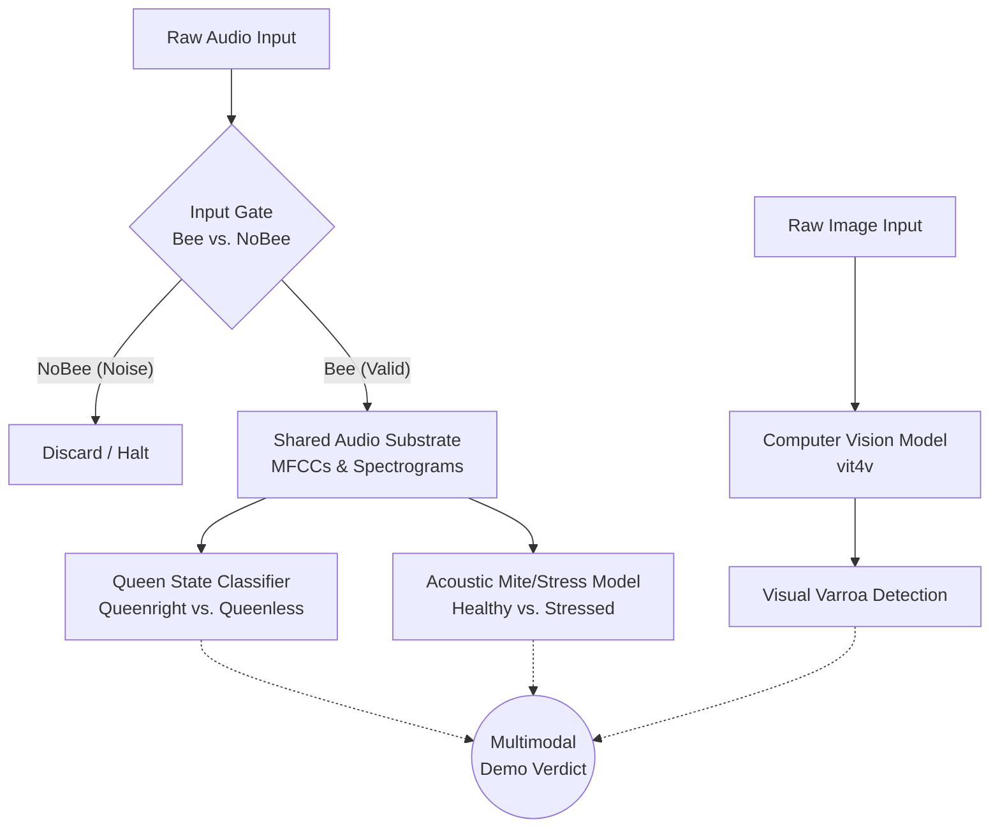

# Bees Non-Invasive Acoustic Monitoring

This repository contains a multi-stage, multimodal processing pipeline for non-invasively assessing the state of a beehive.

## System Architecture

The following diagram illustrates our 2-stage logical flow. We strictly enforce a "gate" before running acoustic health checks, and explicitly separate our acoustic capabilities from our visual (Computer Vision) capabilities.

## Architectural Decisions & Dataset Strategy

When building this pipeline, we made deliberate design choices to optimize for speed, compute efficiency, and realistic evaluation. 

| Component | Dataset Used | Our Approach | Reason |
| :--- | :--- | :--- | :--- |
| **Input Gate (Acoustic)** | "To Bee or Not To Bee" (NU-Hive/OSBH) | Deep Learning | Validates if the mic is actually hearing a hive vs. wind/traffic. Acts as a reliability checkpoint. |
| **Queen Presence (Acoustic)** | "To Bee or Not To Bee" (NU-Hive/OSBH) | Deep Learning | Determines if the hive is Queenright or Queenless. |
| **Varroa Mites (Acoustic)** | UrBAN Dataset | Classical ML (Random Forest) | The literature proves handcrafted features (SSDs + MFCCs) with an RF model beat CNNs for acoustic stress. It is vastly lighter to train. |
| **Varroa Mites (Vision)** | BUT-2 / vit4v | Computer Vision | The acoustic datasets (UrBAN/NU-Hive) provide no visual mite signal. For the multimodal demo, we rely on co-registered image/audio from the BUT dataset. |

### Why We Don't Download the Full UrBAN Dataset

The full UrBAN dataset is over 2,000 hours of high-resolution audio (hundreds of gigabytes). However, the ground truth labels for Varroa mites (PVMI scores derived from physical alcohol-wash inspections) only exist for a handful of specific dates (e.g., Aug 24, Sep 1, Sep 30, 2022). 

Because the labels are sparse, downloading the whole dataset is a massive waste of storage and time. Our selective download strategy is:
1. Download the small inspection metadata CSV first.
2. Select ~3 hives to ensure we can do a strict "hive-held-out" split during training.
3. Download **only** the audio from the inspection day and the preceding day for those specific hives.

This drops our local footprint from hundreds of GBs to less than 10 GB.

## Directory Structure

*   `dataset/` - Not tracked by git. Drop your unzipped "To bee or not to bee" and UrBAN audio slices here.
*   `eda/` - Jupyter Notebooks for exploratory data analysis and visualizing acoustic feature separation.
*   `src/` - Core pipeline scripts including feature extraction, training loops, and model definitions.
*   `models/` - Not tracked by git. Saved model checkpoints (`.pkl`, `.pt`) are written here.
